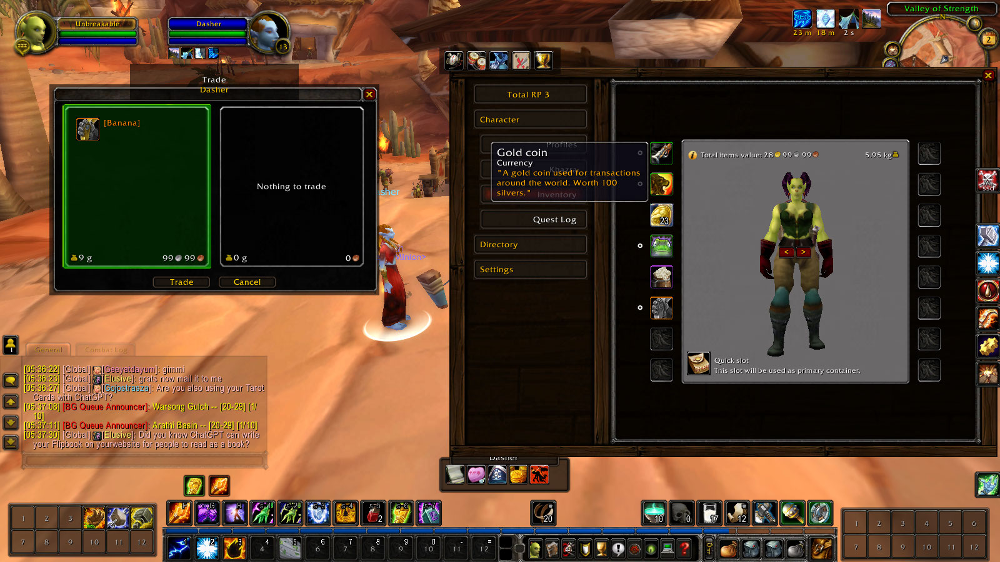

# Total-RP-3 Extended (WotLK 3.3.5a) # 

This addon is currently in alpha and not for public distribution yet.
version: Alpha35.
-backport by J3 

Features working:
- RP3 inventory, TRP3 Item creation, TRP Item trading, and player RP stashes.
- Database manager tool
- import/export item databases

partially working working: 
workflows, campaigns, quest.

not working yet:
  - advanced/expert scripting and features.

for use with TRP3 backport https://github.com/joyvanderveeken/Total-RP-3-WotLK, by joyvanderveeken

  

# Install #
- place in interface/addons folder
Install these folders beside the unmodified public WotLK TRP3 backport:
  totalRP3_Extended
  totalRP3_Extended_Tools

Do NOT replace totalRP3 or totalRP3_Data.

This project is a fork of Total RP 3 Extended, https://github.com/Total-RP/Total-RP-3-Extended, originally licensed under the Apache License 2.0.

Please contact the maintainer before including this fork in any launcher, automated repository, or commercial distribution.

for use with TRP3 backport https://github.com/joyvanderveeken/Total-RP-3-WotLK, by joyvanderveeken

A Note from the Maintainer
This fork was shaped in quiet hours, for the sake of community and immersion. It is offered in trust, not for profit. Inclusion in third-party launchers, automated repositories, or commercial bundles requires explicit written permission from the maintainer.

Support is only provided for versions downloaded directly from this repository. If the addon is obtained through any other source—including launchers or automated repositories—please do not expect troubleshooting or updates.

If you wish to collaborate, contribute, or distribute this work beyond personal use, please reach out. Respect is the first ritual.
